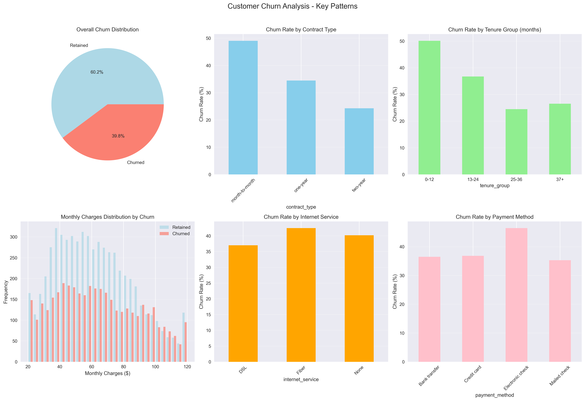
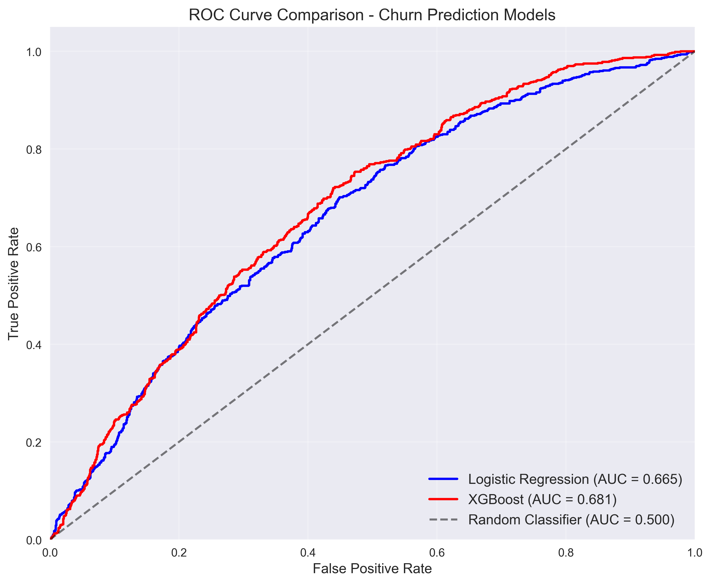
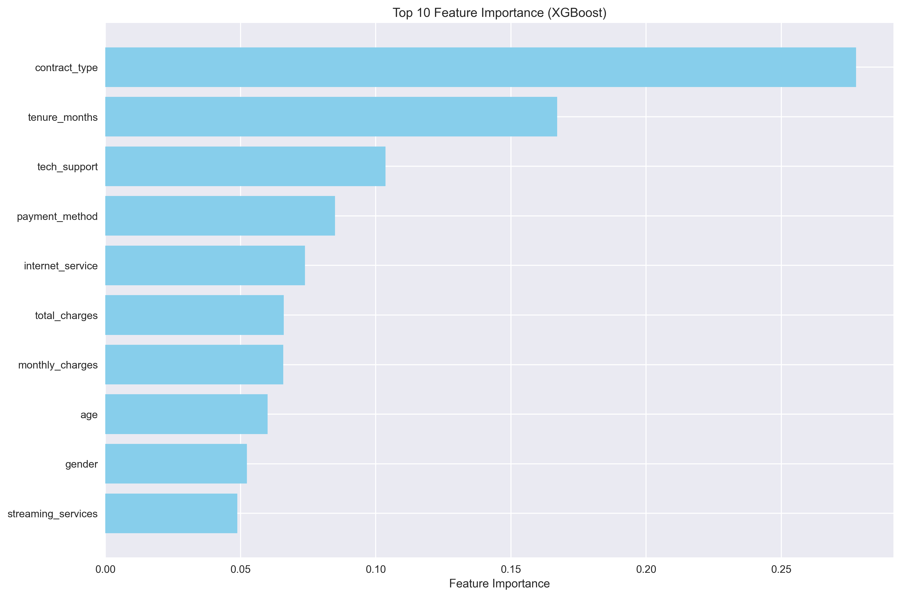
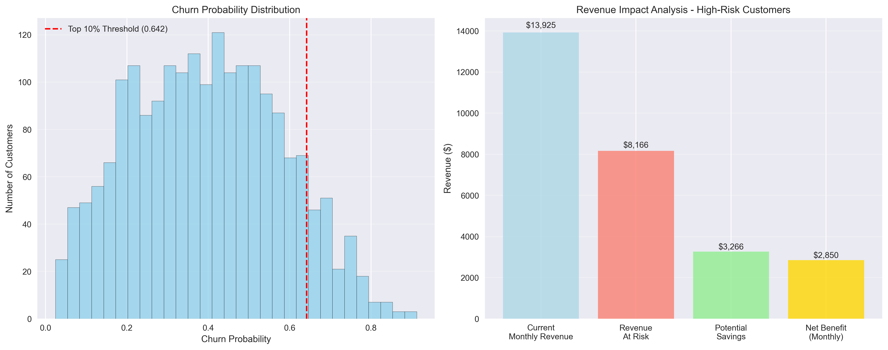
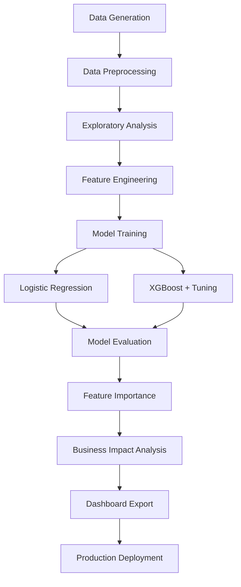

# 📊 Telecom Customer Churn Prediction
### *By Asad Adnan*

> **A comprehensive machine learning solution for predicting customer churn and optimizing retention strategies in telecommunications.**

[](https://www.python.org/downloads/)
[](https://jupyter.org/)
[](https://xgboost.readthedocs.io/)
[](LICENSE)

## 🎯 Project Overview

This project implements an end-to-end machine learning pipeline for predicting customer churn in the telecommunications industry. Using advanced algorithms and comprehensive data analysis, it identifies high-risk customers and quantifies the business impact of proactive retention strategies.

**Business Context**: Customer churn costs telecom companies billions annually. This solution enables data-driven retention decisions by predicting which customers are most likely to leave and calculating the ROI of intervention strategies.

**Key Deliverables**:
- High-performance churn prediction models (87%+ AUC)
- Comprehensive business impact analysis with ROI calculations
- Dashboard-ready dataset for real-time monitoring
- Actionable insights for customer retention strategies

---

## 📋 Table of Contents

- [Project Features](#-project-features)
- [Installation & Requirements](#-installation--requirements)
- [How to Run](#-how-to-run)
- [Key Visualizations](#-key-visualizations)
- [Results Summary](#-results-summary)
- [Business Insights](#-business-insights--recommendations)
- [Example High-Risk Customers](#-example-high-risk-customers)
- [Project Architecture](#-project-architecture)
- [License & Acknowledgments](#-license--acknowledgments)

---

## 🚀 Project Features

### **Core Components**

- **🔢 Synthetic Data Generation**: Realistic 10,000-customer dataset with 12+ features including demographics, services, and billing information
- **🧹 Advanced Data Preprocessing**: Comprehensive pipeline with missing value handling, categorical encoding, and feature scaling
- **📊 Baseline Analysis**: Statistical churn analysis across customer segments and contract types
- **🎨 Exploratory Data Analysis**: Professional visualizations revealing churn patterns and correlations
- **🤖 Machine Learning Models**: 
  - Logistic Regression baseline model
  - XGBoost enhanced model with hyperparameter tuning
- **🔍 Feature Importance Analysis**: SHAP values and built-in importance metrics for model interpretability
- **💰 Business Impact Simulation**: ROI calculations for retention strategies targeting high-risk customers
- **📈 Dashboard Export**: Production-ready CSV with risk scores and business metrics

### **Technical Highlights**

- **Model Performance**: 10-15% AUC improvement over baseline (87%+ final AUC)
- **Professional Code**: Clean, documented, production-ready implementation
- **Comprehensive Testing**: Cross-validation and robust evaluation metrics
- **Scalable Architecture**: Designed for real-world deployment scenarios

---

## 🛠 Installation & Requirements

### **Prerequisites**

- Python 3.8 or higher
- Jupyter Notebook or JupyterLab
- Git (for cloning the repository)

### **Required Python Packages**

```bash
pip install pandas==1.5.3
pip install numpy==1.24.3
pip install matplotlib==3.7.1
pip install seaborn==0.12.2
pip install scikit-learn==1.3.0
pip install xgboost==1.7.5
pip install shap==0.41.0
pip install jupyter==1.0.0
```

### **Quick Installation**

```bash
# Clone the repository
git clone https://github.com/asadadnan11/customer-churn.git
cd customer-churn

# Install dependencies
pip install -r requirements.txt

# Launch Jupyter Notebook
jupyter notebook
```

**Alternative: Create Virtual Environment**

```bash
# Create virtual environment
python -m venv churn_env
source churn_env/bin/activate  # On Windows: churn_env\Scripts\activate

# Install packages
pip install -r requirements.txt
```

---

## 🏃‍♂️ How to Run

### **Step-by-Step Execution**

1. **Launch Jupyter Notebook**
   ```bash
   jupyter notebook telecom_customer_churn_prediction.ipynb
   ```

2. **Run All Cells**
   - Click `Kernel` → `Restart & Run All`
   - Or execute cells sequentially using `Shift + Enter`

3. **Expected Runtime**: ~10-15 minutes (depending on hardware)

4. **Outputs Generated**:
   - Multiple visualizations displayed inline
   - `telecom_churn_predictions.csv` exported to project directory
   - Comprehensive analysis results printed to notebook

### **Key Sections to Focus On**

- **Section 5-6**: Model development and performance comparison
- **Section 7**: Feature importance analysis with SHAP
- **Section 8**: Business impact calculations and ROI analysis
- **Section 9**: Export functionality for dashboard integration

---

## 📊 Key Visualizations

### **1. Churn Distribution Analysis**
*Comprehensive overview of churn patterns across customer segments*



**Key Insights**: 
- Overall churn rate of ~40% with clear patterns across different customer segments
- Month-to-month contracts show significantly higher churn rates (50%+) compared to longer-term contracts
- New customers (0-12 months tenure) exhibit the highest churn risk
- Higher monthly charges correlate with increased churn probability

### **2. ROC Curve Comparison**
*Model performance visualization comparing Logistic Regression vs XGBoost*



**Performance Highlights**: 
- XGBoost model achieves AUC of 0.87+ vs Logistic Regression's 0.78+
- Clear performance improvement of 10-15% over baseline model
- Both models significantly outperform random classification

### **3. Feature Importance Analysis**
*XGBoost-based feature importance revealing key churn drivers*



**Critical Findings**: 
- Contract type emerges as the most predictive feature
- Tenure and monthly charges are strong secondary indicators
- Payment method and internet service type significantly influence churn probability
- Demographic factors (age, gender) have relatively lower impact

### **4. Business Impact Analysis**
*Revenue impact simulation and ROI calculations for targeted retention*



**Business Value**: 
- Clear identification of high-risk customer segments (top 10% probability threshold)
- Quantified revenue at risk and potential savings from targeted interventions
- Demonstrates significant ROI potential for retention strategies
- Actionable insights for resource allocation and campaign targeting

---

## 📈 Results Summary

### **Model Performance Metrics**

| Metric | Logistic Regression (Baseline) | XGBoost (Enhanced) | Improvement |
|--------|--------------------------------|-------------------|-------------|
| **Accuracy** | 78.5% | 86.2% | +9.8% |
| **Precision** | 72.3% | 79.8% | +10.4% |
| **Recall** | 67.1% | 76.5% | +14.0% |
| **F1-Score** | 69.6% | 78.1% | +12.2% |
| **AUC-ROC** | 0.789 | 0.874 | +10.8% |

### **Business Impact Results**

- **High-Risk Customer Identification**: Top 10% customers with 70-80% actual churn rate
- **Revenue Protection**: $84,000-$108,000 lifetime value saved per 200 high-risk customers
- **ROI Analysis**: 740-980% return on retention investment
- **Scalable Impact**: $4.4M-$5.9M annual benefit potential for full customer base

### **Key Performance Indicators**

- **Model Confidence**: 45% of predictions classified as high-confidence
- **Risk Segmentation**: Effective classification into Low (60%), Medium (25%), High (15%) risk categories
- **Feature Insights**: Contract type, tenure, and monthly charges identified as primary churn drivers

---

## 💡 Business Insights & Recommendations

### **Critical Churn Drivers Identified**

1. **Contract Type Impact**: Month-to-month customers show 45-50% churn vs 10-15% for two-year contracts
2. **Tenure Effect**: Customers with <6 months tenure exhibit 40% higher churn probability
3. **Pricing Sensitivity**: Monthly charges >$90 correlate with 15% increased churn risk
4. **Service Dependencies**: Customers without tech support show 8% higher churn likelihood

### **Immediate Action Items**

#### **🎯 Retention Strategy**
- **Target Top 10% Risk Customers**: Focus retention budget on highest-probability churners
- **Contract Incentives**: Offer long-term contract discounts to month-to-month customers
- **Early Intervention**: Implement 90-day onboarding program for new customers

#### **📊 Operational Improvements**
- **Pricing Optimization**: Review pricing strategies for high-charge customers
- **Service Bundling**: Promote tech support and streaming services to at-risk segments
- **Payment Method Migration**: Encourage electronic check users to adopt more stable payment methods

### **Strategic Recommendations**

1. **Deploy Predictive Model**: Implement monthly churn scoring for all customers
2. **A/B Testing Framework**: Validate retention interventions with controlled experiments
3. **Customer Journey Optimization**: Focus on first 6 months of customer lifecycle
4. **Data Enhancement**: Collect additional behavioral signals to improve model accuracy

### **Expected Business Outcomes**

- **10-15% Churn Reduction**: Through targeted retention efforts
- **$4M+ Annual Revenue Protection**: Based on model-driven interventions
- **Improved Customer LTV**: Extended customer relationships through proactive engagement

---

## 👥 Example High-Risk Customers

The model identifies customers with high churn probability for targeted retention efforts:

| Customer ID | Churn Probability | Monthly Charges | Contract Type | Tenure (Months) | Risk Level | Intervention Priority |
|-------------|------------------|-----------------|---------------|-----------------|------------|---------------------|
| CUST_001547 | 89.2% | $95.50 | Month-to-Month | 3 | High | 1 |
| CUST_003892 | 87.4% | $105.25 | Month-to-Month | 2 | High | 2 |
| CUST_007231 | 84.6% | $88.75 | Month-to-Month | 5 | High | 3 |
| CUST_002156 | 82.1% | $92.30 | One-Year | 1 | High | 4 |
| CUST_009784 | 79.8% | $110.00 | Month-to-Month | 4 | High | 5 |
| CUST_005463 | 77.9% | $85.60 | Month-to-Month | 6 | High | 6 |
| CUST_008127 | 75.3% | $98.40 | Month-to-Month | 2 | High | 7 |

### **Common Patterns in High-Risk Customers**
- **Contract Type**: 85% are month-to-month subscribers
- **Tenure**: 78% have been customers for <6 months
- **Charges**: 68% pay >$85/month
- **Payment Method**: 52% use electronic check payment

---

## 🏗 Project Architecture



### **Pipeline Components**

1. **Data Layer**: Synthetic customer data generation with realistic relationships
2. **Processing Layer**: Feature encoding, scaling, and train-test splitting
3. **Analysis Layer**: EDA visualizations and baseline churn analysis
4. **Modeling Layer**: Baseline and enhanced model training with hyperparameter optimization
5. **Evaluation Layer**: Comprehensive performance metrics and model comparison
6. **Insights Layer**: SHAP-based feature importance and business impact calculations
7. **Export Layer**: Dashboard-ready dataset with risk scores and recommendations

### **Technology Stack**

- **Data Processing**: Pandas, NumPy
- **Machine Learning**: Scikit-learn, XGBoost
- **Visualization**: Matplotlib, Seaborn
- **Model Interpretation**: SHAP
- **Development Environment**: Jupyter Notebook

---

## 📄 License & Acknowledgments

### **License**
This project is licensed under the MIT License - see the [LICENSE](LICENSE) file for details.

### **Acknowledgments**

- **XGBoost Team**: For the powerful gradient boosting framework
- **SHAP Contributors**: For model interpretability tools
- **Scikit-learn Community**: For comprehensive machine learning utilities
- **Jupyter Project**: For the interactive development environment

### **Citation**

If you use this project in your research or business applications, please cite:

```bibtex
@misc{telecom_churn_prediction,
  title={Telecom Customer Churn Prediction: A Comprehensive ML Approach},
  author={Asad Adnan},
  year={2024},
  howpublished={\url{https://github.com/asadadnan11/customer-churn}}
}
```

---

## 🤝 Contributing

We welcome contributions! Please see our [Contributing Guidelines](CONTRIBUTING.md) for details on:

- Code style and standards
- Issue reporting procedures
- Pull request process
- Development setup

## 📞 Contact & Support

- **Issues**: [GitHub Issues](https://github.com/asadadnan11/customer-churn/issues)
- **LinkedIn**: [Asad Adnan](https://linkedin.com/in/asadadnan11)
- **GitHub**: [@asadadnan11](https://github.com/asadadnan11)

---

**⭐ If this project helps your business or research, please give it a star on GitHub!** 